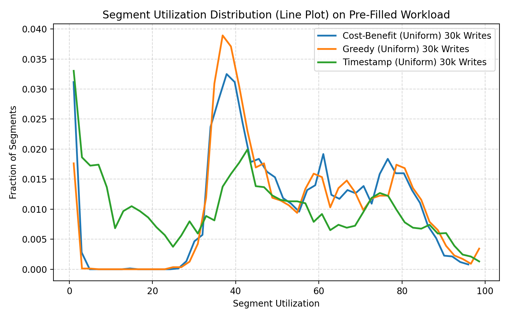
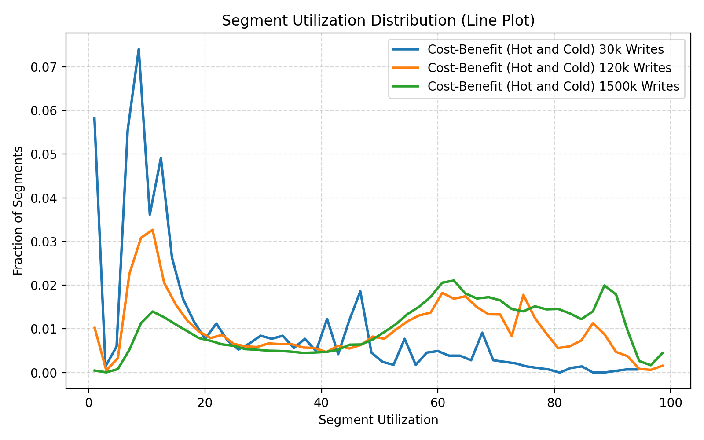
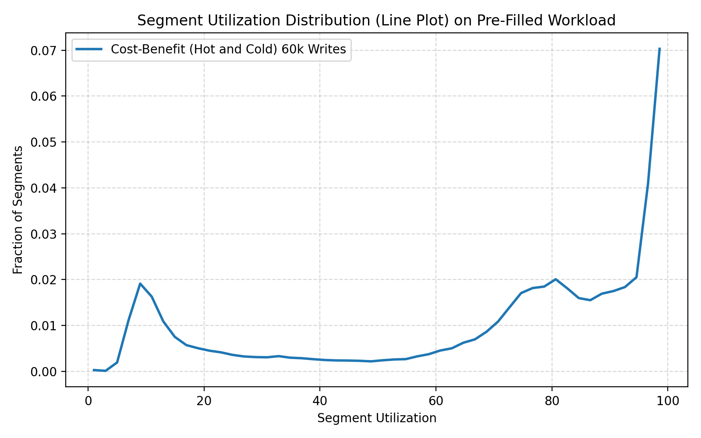
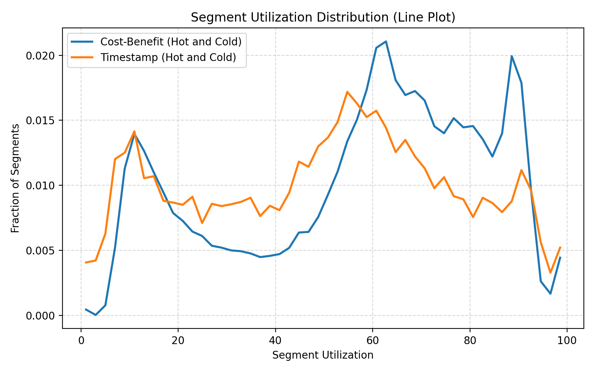
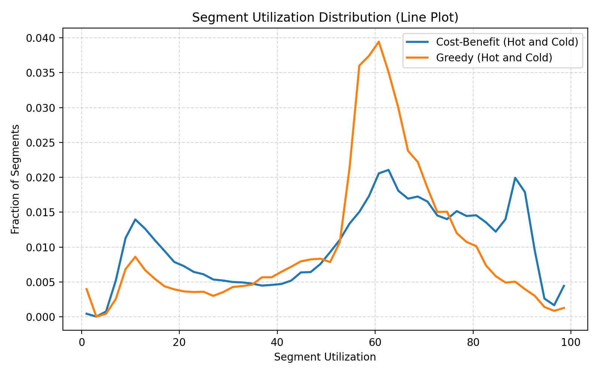
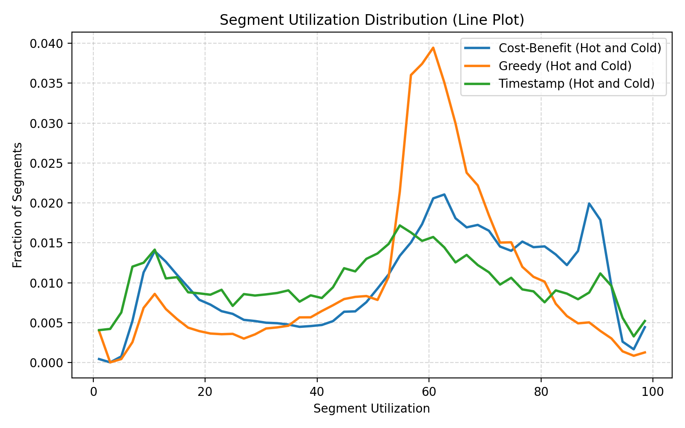
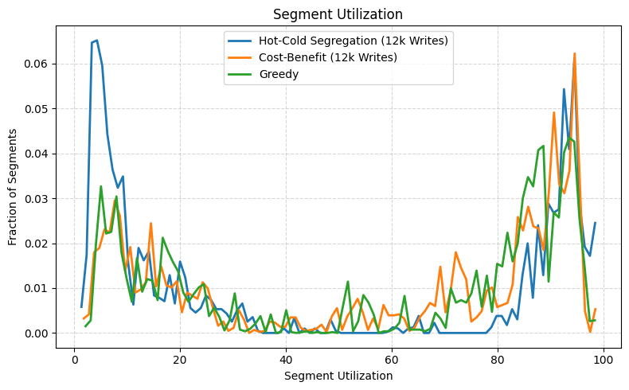
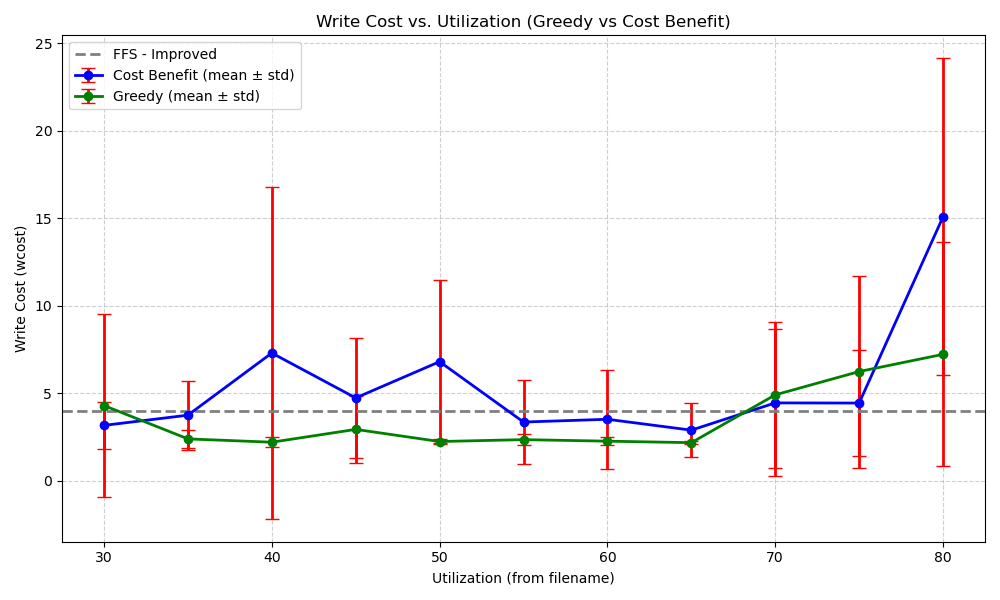
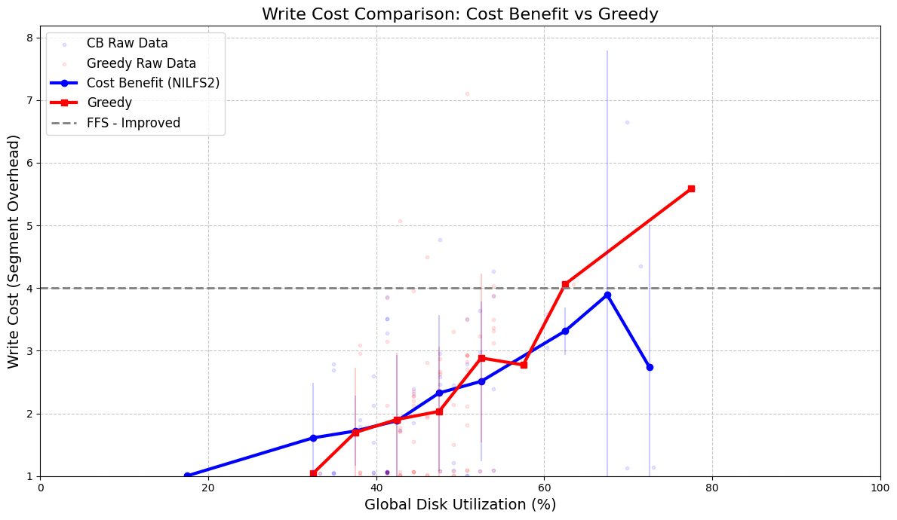
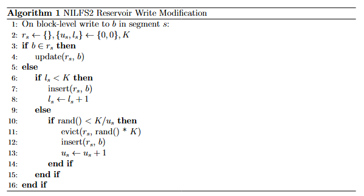

---
author:
- Clint Wang, Jeffery Xu
date: December 2025
title: Evaluating LFS Segment Cleaning Policies in NILFS2
---

# Introduction

Data-driven systems are extremely critical to revenue-generation. Such
systems often must implement their own abstractions to access data
efficiently, consistently, and at a low-cost. They also require
redundancy to be failure-tolerant. For instance, storage engines use
user-space abstractions such as write-ahead logs to maintain these
requirements.

There are also proposed filesystems to handle such abstractions in the
kernel such as Sprite LFS \[[Rosenblum et al.](https://web.stanford.edu/~ouster/cgi-bin/papers/lfs.pdf)\]. LFS amortizes the cost
of writes at the expense of a segment cleaning requirement. This
requirement often decreases performance compared to popular file systems
such as ext4. In this report, we look at log structured file systems
(LFS) and segment cleaning policies that improve performance with regard
to certain benchmarks. We chose to modify NILFS2 \[[Konishi et al.](https://www.researchgate.net/publication/220623451_The_Linux_implementation_of_a_log-structured_file_system)\], a
lightweight Linux implementation of LFS to evaluate several cleaning
policies.

# Design

To analyze performance of alternative NILFS2 cleaners, we created a test
suite for the cleaners which allocate space on the disk, filling the
disk partially and performing writes to the disk, since LFS is a write
optimization, we only performed writes to the disk and did not test read
from the disk. We then created various cleaners to compare against the
default timestamp-based policy. We also propose a new segregation-based
segment cleaning policy and evaluate it on our workloads.

# Implementation

## NILFS2 Changes

We did not make changes the the NILFS2 linux kernel module. Instead, we
made changes to the user mode cleaner daemon provided by `nilfs-utils`.
The cleaner daemon runs in user mode and is easily modified to support
our project goals. We modified the daemon to support injection of custom
segment cleaning policies as plugins and to write logs recording segment
utilization before every clean operation. We support policy plugins of
two types:

1.  **Segment Evaluation** plugins modify the way segments are
    evaluated. By default, NILFS2 filters out eligible segments, sorts
    the segments by timestamp, and selects the top-n segments. We
    modified the segment cleaning pipeline to allow for custom
    comparators and segment eligibility filters. We use this for our
    greedy and cost-benefit policies.

2.  **Segment Selection** plugins modify the way segments are selected.
    Because segment selection modifications often require custom
    comparators and eligibility filters, segment selection plugins are
    also required to implement all functions required for segment
    evaluation plugins. We use this for our hot-cold segregation policy.

The NILFS2 user mode cleaner `nilfs_cleanerd` uses an age-based segment
cleaning policy. The policy cleans segments that maximize a score $s=-t$
where $t$ is the last modified time of the segment. We refactored this
policy into a plugin which we call **Timestamp**.

## Alternative Cleaners

To understand the baseline differences between a kernel-based and a
user-space segment cleaning policy, we created two alternative cleaners,
a greedy approach and a cost-benefit approach both based on cleaning
policies used in Sprite LFS \[[Rosenblum et al.](https://web.stanford.edu/~ouster/cgi-bin/papers/lfs.pdf)\]:

1.  **Greedy** cleans segments with the largest number of reclaimable
    blocks $n_x-l_x$ where $S$ is the set of all eligible segments,
    $n_x$ is the number of written blocks and $l_x$ is the number of
    live blocks for segment $x$: $$\text{argmax}_{i \in S}n_i-l_i$$

2.  **Cost Benefit** cleans segments maximizing the following score:
    $$s=\frac{a(1-u)}{(1+u)}$$ Where $a$ is the age of the segment
    (cleaning time - last modified time) and $u$ is the segment
    utilization $u=\frac{l}{n}$. $1-u$ represents the benefit, or the
    number of reclaimable blocks and $1+u$ represents the cost of
    reading and writing the blocks when cleaning the segment. The score
    is then weighted by the age $a$ so that older segments (cold
    segments) will be cleaned at a higher utilization.

3.  **Segregation** is based on the cost benefit policy, proactively
    separating hot and cold segments. Define $S$ as the set of all
    eligible segments, $w$ as an age window hyperparameter, and
    $a_x, u_x$ representing the age and utilization of a segment $x$,
    respectively. The policy selects segments to clean using:
 
$$\left\{i \;\middle|\; |a_i-a_s| < w, \forall i \in S\right\}, \text{where }s \gets \text{argmax}_{j \in S}\frac{a_j(1-u_j)}{(1+u_j)}$$

 
    In the Results section, we identify key issues with cost benefit regarding
    cold start and propose this new policy to be used alongside cost
    benefit.

## Simulation

To evaluate the cleaning policies, we built several file system activity
simulators following the Sprite LFS file system simulation model
\[[Rosenblum et al.](https://web.stanford.edu/~ouster/cgi-bin/papers/lfs.pdf)\]. Our NILFS2 configuration uses a segment size of 8
MB and is allocated 512 MB. We built the following simulators:

1.  **Uniform Access** writes random 32KiB changes to the filesystem
    these changes are uniformly distributed across 128MiB files.

2.  **Fresh Hot/Cold Access for segment util** writes 32KiB changes to
    the filesystem distributed unevenly across 128MiB files. 90% of
    writes fall into the upper 12.5% of the 128MiB space, the remaining
    10% fall uniformly across the whole 128MiB space. This simulates
    some user workload where many changes are applied to few files and
    some changes are applied across the remaining files; this is common
    complex modern user workloads and databases.

3.  **Pre-Written Hot/Cold Access for segment util** writes 32KiB
    changes to the filesystem distributed unevenly across 128MiB files,
    in the same porportions as **Fresh Hot/Cold Access for segment
    util**. However, we prepopulate the filesystem by filling the whole
    128MiB space first. We imagine this workload as a user performing a
    fresh download of a large project before beginning work.

We chose 32KiB for the write size to allow for extensive fragmentation,
yielding approximately 256 possible fragments per segment. The Sprite
LFS file system simulation model \[[Rosenblum et al.](https://web.stanford.edu/~ouster/cgi-bin/papers/lfs.pdf)\] overwrites 4 KB
files with a maximum possible segment size of 1 MB which yields the same
number of fragments per segment as our simulators.

## Data Collection

Using the changes we made in the cleaner daemon, we simply need to run
our workloads and force cleans, which we do every 10 writes in the
workload.

# Experimental Results

## Uniform Segment Utilization

Figure 1: Segment utilization distribution for uniform 30k write workload under three policies.

 

According to Figure 1, cost-benefit, greedy, and timestamp
perform approximately the same for segment utilization across uniform
writes. Timestamp is a good approximation of cost-benefit or greedy as a
segment's utilization falls evenly with age. In the graph of only 30k
writes, timestamp performs a marginally worse than greedy and cost
benefit. This is largely due to variance and as writes continue,
utilization largely converges for all three policies on the uniformly
random workload.

## Non-Uniform Segment Utilization

### Workloads

We propose two workloads with hot and cold segments with the assumption
that many realistic workloads share a similar write pattern of some
files that are updated very frequently and others that are updated much
less frequently, particularly databases whose journals and data pages
may be written very frequently but whose index pages are written far
less often.\
Figure 2 shows an interesting trend: as the number
of writes increases from 30k to 1500k, cold segments emerge and retain
their utilization, creating a natural segregation between hot and cold
segments.

Figure 2: Segment utilization distribution for hot–cold workload under increasing write
counts.

 

We hypothesize that cost-benefit requires a spatial or temporal buffer
to segregate hot and cold segments. Using a pre-written workload can
offset this buffer by manually performing segregation. Figure
3 confirms this hypothesis, showing a similar
split in the pre-written workload with a much higher overall
utilization. The cleaner is experiences a lower load with the already
settled space and can be much more aggressive on older cold segments.
This happens as an artifact of our workload. Initial segments are filled
with all hot files or all cold files; therefore, as the program runs,
the segments continue to stay segregated by temperature.

### Comparison of Policies

Figure 3: Hot–cold workload with pre-
filled segments. (Note that the spike
at 100% segment utilization is expected
since our workload plots all dirty seg-
ments whereas Sprite LFS plots only seg-
ments available for cleaning. This means
many segments are fully utilized which is
good. )

 

Figure 4: Timestamp vs Cost–Benefit
(1500k writes). We no longer see the spike
at 100% segment utilization compared to
the pre-filled workload since the pre-filled
workload fills segments so that they can
stay at 100% utilization for a while.

 

Figure 4 shows that cost-benefit performs better than
timestamp under non-uniform write access. Timestamp over prioritizes
cold segments and rewrites them more frequently than cost-benefit. This
leads to wasted effort on cold segments that do not need to be refreshed
yielding lower segment utilization overall for timestamp.\
Likewise, Figure 5 shows that cost-benefit performs better than
greedy as well. Greedy over-cleans hot segments and under-cleans cold
segments, resulting in a large amount of utilization at 60%. This also
translates to better write costs for cost-benefit as shown in the Implementation section.

Figure 5: Greedy vs Cost–Benefit (1500k
writes).

 

Figure 6: Timestamp vs Greedy vs
Cost–Benefit (1500k writes).

 

### Proactive Segregation

Figure 7: Segment utilization distribution for non-uniform 12k cold start write workload
under three policies.

 

The pre-written workload shows the need for active segregation of hot
and cold segments when starting from a cold file system. This is also in
systems with highly dynamic working sets since there is not enough time
to wait for segments to naturally be segregated. To resolve this, we
created an active segregation segment cleaner. We ran a non-uniform
access workload for a short period of time (12k writes). Figure 7
shows that cost benefit and greedy perform around the same in a cold
start system while the segregation policy develops a bimodal cleaning
policy that maximizes cost benefit.

However, the segregation policy should not be used as the main policy,
since it can only clean hot or cold segments at once. This is ideal in a
cold-start situation where cost benefit would perform worse with mixed
segments, but would suffer in a situation where the cost benefit scores
of a hot and cold segment are around the same.

Instead, segregation should be performed where a lot of mixed segments
exist.

## Non-Uniform Write Cost

Sprite LFS \[[Rosenblum et al.](https://web.stanford.edu/~ouster/cgi-bin/papers/lfs.pdf)\] performs batch segment cleaning when the
number of clean segments fall below a threshold until the number of
clean segments passes a threshold.

We aim to replicate the write cost results of Sprite LFS. Our evaluation
workload set a constant initial disk capacity and performs writes using
pre-written hot/cold access until all segments are filled. The workload
invokes the cleaner daemon manually and cleans until the number of
segments passes a threshold proportional to the size of the initial disk
capacity. On every clean, the cleaner reports the average write cost
$c = \frac{2}{1-u}$.

<figure id="fig:wc1" data-latex-placement="H">

<figcaption>Figure 8: Write Cost of Greedy and Cost Benefit (NILFS2) on a hot and
cold workflow that gradually fills up the entire disk. </figcaption>
</figure>
 
Because timestamp and greedy are approximately the same policy within
the frame of hot/cold access, we only evaluated the write cost of greedy
and cost-benefit. In Figure 8 NILFS2 write cost increases as utilization
surpasses 60% for both greedy and cost-benefit similar to Sprite LFS.
NILFS2 also surpasss FFS at lower-utilization for writes highlighting a
primary strength of NILFS2: small writes and small-file creation.
However, cost-benefit and greedy perform around the same in terms of
write cost.

Sprite LFS has a segment size of 1 MB while NILFS2 has a default segment
size of 8 MB. The larger segment size allows NILFS2 to have more
efficient cleaning and less metadata overhead. Unfortunately, a large
segment size means that the natural segment segregation of hot/cold
blocks required by cost-benefit takes much longer. We ran our workloads
on small disks of 512 MB for short periods of time which did not give
the segments much space to be segregated.

### Alternative Workloads for Non-Uniform Write Cost

From the results shown in non-uniform segment utilization, we argue that cost-benefit requires either time or
space to generate accurate results. To see if time plays a factor in
write cost, We modified the workload to be temporally scalable.

<figure id="fig:wc2" data-latex-placement="H">

<figcaption>Figure 9: Write Cost of Greedy and Cost Benefit (NILFS2) on a hot and
cold workflow that gradually fills up the entire disk. </figcaption>
</figure>

The modified workload writes repeatedly at a fixed disk capacity using
pre-written hot/cold access and runs the cleaner daemon once every 500
writes. The cleaner was modified to clean a maximum of 40 out of 64
available segments. Figure 9 indicates that with this workload cost benefit is
shown to have a lower write cost than greedy. The modified workload does
not determine write cost with the same precision as the original
workload. It instead estimates write cost using:
$$\frac{1}{m}\sum_{i \in {1..n}} \frac{2}{1-u_i}$$ Where
$m = \mathbb{E}[n]$ and $n$ is the number of segments that are actually
cleaned. It is actually simple to record $n$ instead of estimating it
but due to time constraints, we were unable to modify the cleaner daemon
to record $n$ and aggregate the average which would take a significant
refactor.

# Conclusion

## Future Work

We propose a modification to the NILFS2 kernel-level implementation in
Linux to allow for a hybrid segment cleaner that can dynamically switch
between segregation and cost benefit policies. Segregation is ideal when
there exist many mixed segments within the system (i.e. segments that
may be 90% cold and 10% hot but because of the hot-blocks, the age based
on last modified time makes the segment appear to the cleaner as a hot
segment). Cost benefit is ideal when segments are pre-filled with hot or
cold data which is common in many systems. Segregation is necessary
since many systems have different working sets for various processes
which lead to mixed segments.

It is computationally expensive and wasteful to track the ages of every
block in every segment. We propose to implement a uniform
reservoir-sampling algorithm to accurately estimate the \"hotness\" of a
segment. The algorithm is as follows:

In the algorithm, $r_s$ is the reservoir, a set of at most $K$ blocks
and their last modified timestamps. $K$ is a hyperparameter that can be
user-tuned. $u_s$ and $l_s$ represent the number of unique writes to
blocks (rewrites to the same block do not add to $u_s$) that the
reservoir knows about, and the number of elements in the reservoir,
respectively.

As the reservoir represents an accurate sampling of last modified
timestamps from blocks in the segment, we can sample the reservoir for
an $O(1)$ constant read of the \"hotness\" of a segment.

## Challenges and Mistakes

We originally set out with a much broader scope of work. One major
mistake we made was fixating on replicating the non-uniform bimodal
distribution of segment utilization seen when cleaning with cost benefit
in Sprite LFS, which took around 40 man hours. Each of our workload runs
would take multiple hours (1.5 million+ writes) until we could see the
actual bimodal distribution.

There was a lot of confusion on why the graphs did not match with our
hypotheses (and Sprite LFS results). Since there were a lot of
contributing factors (i.e. cleaning frequency, watermark thresholds,
number of segments cleaned per iteration), it was only with a lot of
experimentation and testing that we were able to isolate time as the
factor. Instead of fixating on these differences, we should have split
up the work more efficiently to create and test more segment cleaning
policy ideas.

# Appendix

## Specification

We used a CloudLab EmuLab d430 node for all testing. The filesystem
actions were all performed on the SSD on a 20GiB partition.

|  | Details                                                                                                         |
|------------|-----------------------------------------------------------------------------------------------------------------|
| **CPU**    | 2 x 2.4 GHz 64-bit 8-Core Xeon E5-2630v3 processor, 8.0 GT/s bus speed, 20 MB L3 cache, VT-x, VT-d, EPT support |
| **Memory** | 8 x 8GB 2133 MT/s DDR4 RAM, 200 GB 6Gbps SATA SSD, 2 x 1 TB 7200 RPM 6 Gbps SATA disks                          |
| **OS**     | Ubuntu 22.04.2 LTS, Linux kernel 5.15.0                                                                         |

 

We used nilfs-tools version 2.2.8-1 and forked our dev tools from
<https://github.com/nilfs-dev/nilfs-utils> on commit hash
3e172d19ad654e6f65742b9f81992c656ecc0524.

## Git

<https://github.com/txst54/nilfs-utils>

## Notes

This project took a total of 70 man-hours. LLMs were used to initially
generate boilerplate code for the plugin harness and workload logger in
nilfs-utils but we later modified most of the LLM code by hand due to
issues (it turns out that LLMs often misinterpret struct field names) or
modifications that we wanted to implement.
