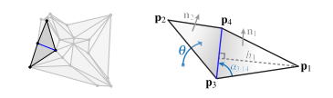
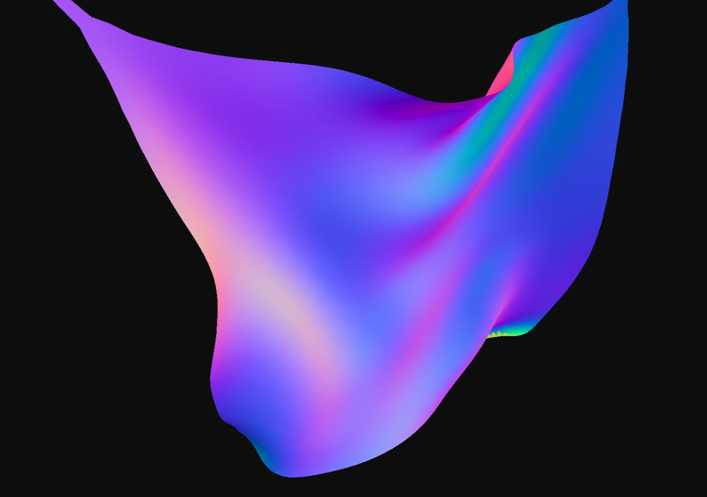
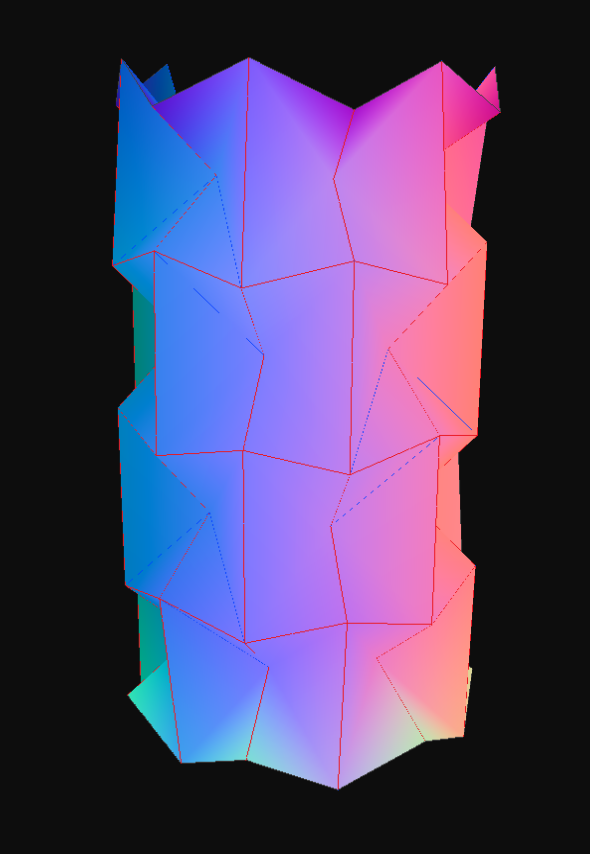
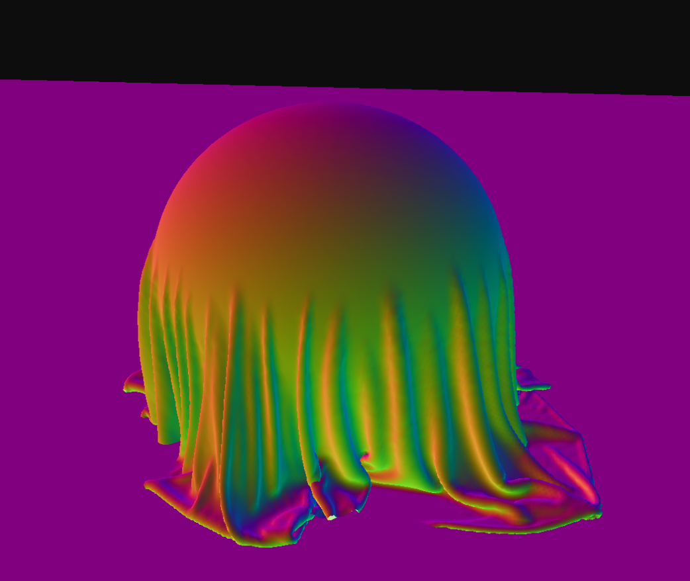
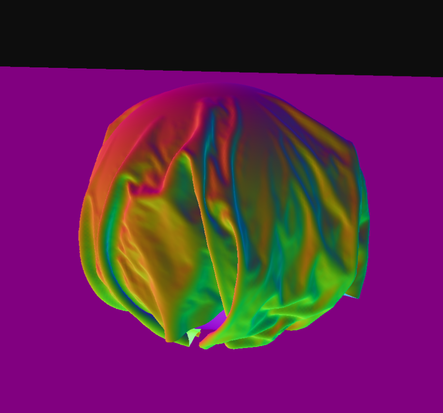
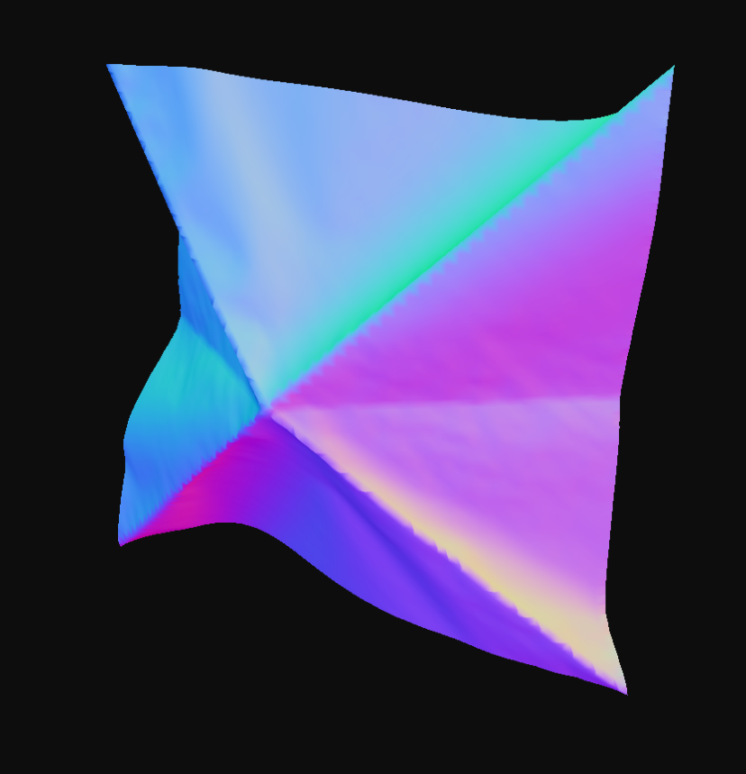

---
author:
- Clint Wang
bibliography:
- sample.bib
date:
  - May 2026
title: Implementing High-Resolution Cloth and Origami Simulations on GPU using XPBD
---

# Introduction and Theory

I built a real-time physical simulation framework for rigid and
cloth objects using extended position-based dynamics 
\[[XPBD, Macklin et al.](https://mmacklin.com/xpbd.pdf)\]. To evaluate the strengths and
limitations of XPBD, I extended a baseline shape-matching PBD cloth
simulation with self-collision handling, friction constraints, and
collisions against rigid bodies. After discovering the limitations of
shape-matching and triangular meshes, I implemented a particle cloth
that uses distance constraints. I then created a real-time origami
simulation by adding stiff hinge constraints to the cloth model.

## Position-based Dynamics

The baseline cloth simulation uses position-based dynamics (PBD), which
can be thought of as a Verlet-like position prediction step, followed by
an implicit-style constraint projection. In most implementations, the solver computes a target position, then interpolates between the Verlet predicted position and target position. More formally, we can say that given a constraint scoring function $C(x)$, the constraint solver computes
a per-constraint position delta:
$$
\Delta x = k_js_j\textbf{M}^{-1}\nabla C_j(\textbf{x}_i)
$$
The subscript $i$ denotes the iteration index, $j$ denotes the constraint
index, $k_j \in [0, 1]$ is the constraint stiffness, and the scaling factor $s_j$ is derived:
$$
s_j = \frac{-C_j(\textbf{x}_i)}{\nabla C_j\textbf{M}^{-1}\nabla C_j^T}
$$
Therefore, the issue with PBD is that stiffness depends on the number of constraint
projections performed. In a cloth simulation, the cloth typically has stretching and bending constraints. We refer to the rest position of a cloth as the initial position a cloth started in. 

1. The **stretching constraint** defines how individual edges in the cloth interact with respect to the rest position. 
2. The **bending constraint** defines how multiple edges in the cloth interact with respect to the rest position. 

For the PBD cloth simulation stretching and bending constraints, I use shape matching \[[Meshless Deformations, Muller et al.](https://matthias-research.github.io/pages/publications/MeshlessDeformations_SIG05.pdf)\]. Each triangle in the cloth is constrained to match the corresponding triangle in the rest position via a rotation and a translation. Solving shape-matching is equivalent to solving the [orthogonal Procrustes problem](https://en.wikipedia.org/wiki/Orthogonal_Procrustes_problem), which states that given matrices $A$ and $B$, how can we map $A$ to $B$ using an orthogonal matrix. 

The solver computes a target motion directly, which makes it non-trivial to express the constraint as a scoring function C(x). Rather than deriving motion from the gradient of a constraint energy, the method produces the target configuration explicitly. This distinction does not affect the PBD implementation, but becomes problematic in the XPBD formulation, which relies on an explicit constraint function. Additionally, solving the orthogonal Procrustes problem requires an SVD, which is computationally expensive.

## Extended Position-based Dynamics

Earlier I mentioned that when using PBD, stiffness depends on the number of iterations. XPBD solves this by introducing compliance
$\alpha$ (block diagonal compliance matrix corresponding to
inverse-stiffness) and a Lagrange multiplier per constraint:
$$
\Delta \textbf{x} = \textbf{M}^{-1}\nabla \textbf{C}(\textbf{x}_i)^T \Delta \lambda
$$
XPBD solves $\Delta \lambda$ by approximating each constraint as a local
linear system and performing a Gauss-Seidel update:
$$
\Delta \lambda = \frac{-C_j(\textbf{x}_i)-\tilde\alpha_j\lambda_{ij}}{\nabla C_j \textbf{M}^{-1}\nabla C_j^T + \tilde\alpha_j}
$$
XPBD folds the time step into compliance, defining
$\tilde\alpha = \frac{\alpha}{\Delta t^2}$. 

### Deriving XPBD

Macklin et al. provide a beautiful derivation of XPBD from Newton's equations of motion, specifically the 2nd law of motion:
$$
F = ma
$$

If we subject the equation to forces derived from an energy potential $U(x)$, we get equivalently:
$$
-\nabla U^T(x) = M\ddot{x}
$$

We want to discretize $\ddot{x}$. Recall the central difference from high school calculus:
$$
\dot{x}(t) \approx \frac{x(t+\Delta t) - x(t-\Delta t)}{\Delta t^2}
$$

If we differentiate again, we get:
$$
\ddot{x}(t) \approx \frac{x(t+\Delta t) - 2x(t) + x(t-\Delta t)}{\Delta t^2}
$$

Where superscript $n$ refers to the time step index. Plugging into the equation of motion, we get:
$$
-\nabla U^T(x^{n+1}) = M\left(\frac{x^{n+1} - 2x^n + x^{n-1}}{\Delta t^2}\right)
$$

Recall from high school physics that elastic potential energy is represented by $U = \frac{1}{2}kx^2$ where $k$ is stiffness. Because the constraints $C(x)$ represent displacement from natural position, we can reformulate $U$ as follows:
$$
U(x) = \frac{1}{2} C(x)^T \alpha^{-1} C(x)
$$

Macklin et al. introduce $\alpha$, which represents a block diagonal compliance matrix corresponding to inverse stiffness. Therefore, $\alpha^{-1} = k$. We get:
$$
f_{elastic} = -\nabla_x U^T = -\nabla C^T \alpha^{-1} C
$$

Plugging this back into the equations of motion, we get:
$$
-\nabla C(x^{n+1})^T \alpha^{-1} C(x^{n+1}) = M\left(\frac{x^{n+1} - 2x^n + x^{n-1}}{\Delta t^2}\right)
$$

We can define $\tilde{\alpha} = \frac{\alpha}{\Delta t^2}$ by folding in $\Delta t^2$ from the right side of the equation. We can also redefine force elastic using the semantics of a Lagrange multiplier: $\lambda = -\tilde{\alpha}^{-1} C(x)$. Finally, we can define $\tilde{x} = 2x^n - x^{n-1} = x^n + \Delta t v^n$, which is the predicted position computed by Verlet integration. Now we get the following systems of equations:

$$
M(x^{n+1} - \tilde{x}) - \nabla C(x^{n+1})^T \lambda^{n+1} = 0
$$

$$
C(x^{n+1}) + \tilde{\alpha}\lambda^{n+1} = 0
$$

To solve this coupled nonlinear system, we treat both $x^{n_1}$ and $\lambda^{n+1}$ as unknowns and define:

$$
g(x,\lambda)=M(x-\tilde{x})-\nabla C(x)^T \lambda
$$

$$
h(x,\lambda)=C(x)+\tilde{\alpha}\lambda
$$

so that the system becomes:

$$
g(x,\lambda)=0, \quad h(x,\lambda)=0
$$

However, both equations are nonlinear in $x$ due to $C(x)$ and $\nabla C(x)$, so we solve them using Newton’s method:

$$
\begin{bmatrix}
\frac{\partial g}{\partial x} & \frac{\partial g}{\partial \lambda} \\
\frac{\partial h}{\partial x} & \frac{\partial h}{\partial \lambda}
\end{bmatrix}
\begin{bmatrix}
\Delta x \\
\Delta \lambda
\end{bmatrix}
=
-
\begin{bmatrix}
g(x_i,\lambda_i) \\
h(x_i,\lambda_i)
\end{bmatrix}
$$

The resulting linear system is: 

$$
\begin{bmatrix}
K & -\nabla C(x_i)^T \\
\nabla C(x_i) & \tilde{\alpha}
\end{bmatrix}
\begin{bmatrix}
\Delta x \\
\Delta \lambda
\end{bmatrix}
=
-
\begin{bmatrix}
g(x_i,\lambda_i) \\
h(x_i,\lambda_i)
\end{bmatrix}
$$

We can then solve $\Delta x$ and $\Delta \lambda$ and perform the following update:

$$
\lambda_{i+1} = \lambda_i + \Delta \lambda
$$
$$
x_{i+1}=x_i+\Delta x
$$

Macklin et al. claim that we can set $K\approx M$ with an error on the order of $O(\Delta t^2)$. They also claim that we can assume $g(x_i,\lambda_i)=0$ since this is true given the initial values $x_0=\tilde x$ and $\lambda_0 = 0$. We get:

$$
\begin{bmatrix}
M & -\nabla C(x_i)^T \\
\nabla C(x_i) & \tilde{\alpha}
\end{bmatrix}
\begin{bmatrix}
\Delta x \\
\Delta \lambda
\end{bmatrix}
=
-
\begin{bmatrix}
0 \\
h(x_i,\lambda_i)
\end{bmatrix}
$$

By doing a bit of algebra, we can solve for $\Delta x$:

$$
\Delta x =M^{-1}\nabla C(x_i)^T\Delta \lambda
$$

Then we can substitute $\Delta x$ to get the $\lambda$ update:

$$
[\nabla C(x_i)M^-1\nabla C(x_i)^T + \tilde \alpha]\Delta \lambda = -C(x_i)-\tilde \alpha \lambda_i
$$

$$
\Delta \lambda_j = \frac{-C_j(x_i)-\tilde\alpha_j\lambda_{ij}}{\nabla C_j M^{-1}\nabla C_j^T + \tilde\alpha_j}
$$

By implementing a Gauss-Seidel solution for the systems of linear equations, we can calculate $\Delta \lambda_j$ for a single constraint, then update positions. 

### XPBD Implementation for Cloth
Because shape-matching does
not easily provide a scalar $C$, I chose to keep shape-matching in PBD
while creating a new distance constraint option in XPBD:
$$
C(\textbf{x}) = |\textbf{x}_i - \textbf{x}_j| - L_0
$$
Users can toggle
between the two.

## Self-Collision and Rigid Bodies

For both the triangle and particle cloth collision-detection, I used a
spatial hash. The triangle cloth hashes triangles and runs
vertex-triangle continuous collision detection (CCD). The particle cloth
hashes particles and runs vertex-vertex and sub-stepping.

My implementation of continuous-collision detection predicts collisions
along a path by solving for the earliest exact $t$ in
$\hat x = x+dx\Delta t$ where $\hat x$ intersects any object. I
discovered that CCD with triangles is computationally expensive and
assumes linear approximation of motion resulting in tunneling.

To solve this, I implemented a particle cloth simulation where
collisions are tested betIen vertex particles with a set radius. Since
XPBD makes stiffness independent of iteration, I can set the number of
iterations at a low number. Macklin et al. state that instead of running
1 timestep and $n$ iterations per frame, they obtained a significant
improvement by running $n$ sub-steps and 1 iteration per frame
\[[Small Steps, Macklin et al.](https://mmacklin.com/smallsteps.pdf)\]. By decreasing $\Delta t$ through
sub-stepping, I find that tunneling is virtually eliminated without
implementing CCD.

I implemented a stable cloth-cloth friction that blends tangential
velocities of contacting points:
$$
\textbf{x}_i \gets \textbf{x}_i + k_{\text{friction}}(\textbf{v}_{\text{avg}} - \textbf{v}_i)\Delta t
$$

The total average velocity remains conserved and the relative velocity
always shrinks.

For rigid bodies, I copied the numerical integrators from the rigid
body assignment for the base implementation. I implemented a BVH for
complex mesh collision and a signed distance field for simple rigid body
collisions. I implemented a cloth-rigid body frictional constraint
satisfying Coulomb's law:
$$
C_f(\textbf{x}) = \|(I-\textbf{n}\textbf{n}^T)(\Delta \textbf{x}_i - \Delta \textbf{x}_j) \|
$$
$$
\Delta \lambda = \min(\mu \Delta \lambda_n, \Delta \lambda_f)
$$
Where $\mu$ is the frictional coefficient and $\lambda_n$ is the normal
Lagrange multiplier.

## GPU

To simulate a high-resolution cloth, I found the CPU to be
insufficient. Logically, XPBD fits the GPU SIMD model: compute velocity,
constraints, and position updates in parallel. However, distance
constraints for stretching and bending are co-dependent. Gauss-Seidel
updates the positions themselves:
$$
\text{repeat }\textbf{x}_i \gets \textbf{x}_i + \Delta \textbf{x}
$$
Each update influences neighboring constraints. An alternative is a
Jacobi solve that performs the following:
$$
\textbf{d}_i \gets 0
$$
$$
\text{repeat }\textbf{d}_i \gets \textbf{d}_i + \Delta \textbf{x}
$$
$$
\textbf{x}_i \gets \textbf{x}_i + s\textbf{d}_i
$$
The Jacobi solve updates the initial position produced by Verlet integration. Consequently, the solve takes longer to converge, overshoots, and
violates momentum conservation. Therefore, I adopted a hybrid approach.
I used greedy graph coloring to iteratively select and concurrently
process a subset of independent distance constraints using Gauss-Seidel.
Because graph-coloring would yield a large number of colors (small sets)
for collision constraints, I handle collision constraints using a
parallel Jacobi solve.

## Origami

The goal of the origami simulation is to map a mesh of creases on an
unfolded sheet of paper to the folded version. Typically, the crease
mesh is called a crease pattern and will contain 3 types of edges:

1.  Boundary edges represent the edge of the paper and typically form a
    square.

2.  Mountain fold edges represent creases that fold away from you.

3.  Valley fold edges represent creases that fold towards you.

I base our implementation on the numerical integrator developed by
Ghassei et al. \[[Origami Simulator, Ghassei et al.](https://erikdemaine.org/papers/OrigamiSimulator_Origami7/paper.pdf)\]. Ghassei et al. model a
force
$\textbf{F}_{crease}=-k_{crease}(\theta - \theta_{target})\frac{\partial\theta}{\partial \textbf{p}}$
based on a dihedral crease constraint, which naturally maps to an XPBD
constraint. I evaluate the constraint on hinge diamonds, which are
diamonds that overlay creases. In origami, the dihedral angle is more
usefully defined as the angle betIen the two plane normals, rather than
betIen the planes themselves. A flat unfolded hinge diamond will have a
dihedral angle of 0 according to our convention. To simulate fold
progress, I set
$\theta_{\text{target}} = \pi c_{\text{progress}}\textbf{t}$, where
$c_\text{progress} \in [0,1]$ and $\textbf{t}$ is a vector the size of
the number of hinges, containing $1$ if hinge $i$ is a valley fold, or
$-1$ if hinge $i$ is a mountain fold.

<figure id="fig:hinge" data-latex-placement="H">

<figcaption>Dihedral
crease constraint from Ghassei et al.</figcaption>
</figure>

The constraint is rather simple: $$C = \theta - \theta_{goal}$$ I also
want to know $\nabla C_i$, the gradient of $C$ at point $\textbf{x}_i$.
I get:
$$
\nabla C = [\frac{\partial \theta}{\partial \textbf{x}_1},\frac{\partial \theta}{\partial \textbf{x}_2},\frac{\partial \theta}{\partial \textbf{x}_3},\frac{\partial \theta}{\partial \textbf{x}_4}]
$$

Following the orientation given by Figure
[1](#fig:hinge), the
derivatives for flap vertices $\textbf{x}_1, \textbf{x}_2$ are
proportional to the normals of their respective triangles:
$$\frac{\partial \theta}{\partial \textbf{x}_1} = \frac{\textbf{n}_1}{h_1}, \frac{\partial \theta}{\partial \textbf{x}_2} = \frac{\textbf{n}_2}{h_2}$$
The derivatives for edge vertices $\textbf{x}_3, \textbf{x}_4$ are the
weighted sum of the flap vertex derivatives.
$$
\frac{\partial \theta}{\partial \textbf{x}_3} = \frac{-\cot\alpha_{4, 31}}{\cot \alpha_{3,14}+\cot \alpha_{4,31}}\frac{\textbf{n}_1}{h_1} + \frac{-\cot\alpha_{4, 23}}{\cot \alpha_{3,42}+\cot \alpha_{4,23}}\frac{\textbf{n}_2}{h_2}
$$
$$
\frac{\partial \theta}{\partial \textbf{x}_4} = \frac{-\cot\alpha_{3, 14}}{\cot \alpha_{4,31}+\cot \alpha_{3,14}}\frac{\textbf{n}_1}{h_1} + \frac{-\cot\alpha_{3, 42}}{\cot \alpha_{4,23}+\cot \alpha_{3,42}}\frac{\textbf{n}_2}{h_2}
$$

# Implementation Details

I created a fabric simulation harness in Rust that is compiled to
Web-Assembly (Wasm), and rendered using WebGPU. The harness can be run
in-browser or as a headless binary for advanced debugging. I set up a
simple user interface in the browser to adjust the parameters. The
github repository can be found at
https://github.com/txst54/wasm-cloth-sim. A browser-ready version is up
at my website: https://cloth.clintwang.com.

## Architecture

The Rust core of the simulation is located in `/rust`. All
architecture-specific details (Wasm versus native binary) can be found
in `/rust/src/arch`. GPU-support is only enabled in the Wasm package,
and the native binary is several commits behind the Wasm package, so
outputs may not look the same.

The Wasm package can be built using
`cd rust && wasm-pack build --target web --features gpu`. Since Wasm
packages are compiled as a library, the \"main\" function of the Wasm
package can be found in `/rust/src/arch/wasm/harness.rs`.

Since the native binary is compiled as a binary, the binary entry point
can be found at `/rust/bin/native.rs` and wraps
`/rust/src/arch/native/harness.rs`.

If the GPU compute shaders in particle cloth or particle paper cause
issues, the simulation can be reverted to the serial Gauss-Seidel CPU
implementation by omitting the `gpu` feature flag. All code relating to
the user interface wrapping the Wasm package is located in `/src`.

## Available Simulations

| URL | Simulation |
|:---|---:|
| `/` | Triangle Mesh Cloth Simulation + Rotating BVH Rigid Body |
| `/paper` | Triangle Mesh Paper Simulation |
| `/particle_cloth` | GPU Particle Cloth Simulation + Static SDF Rigid Body |
| `/particle_paper` | GPU Particle Paper Simulation |

I offer 4 simulations located at different sub-URLs. The triangle mesh
simulations run shape-matching PBD constraints by default while the
particle cloth simulations only run distance XPBD constraints for cloth
structure. I have a UI that allows the user to adjust several
parameters relating to the simulation. Since scales for parameters
$k_i \in [0, 1]$ may be very small, or on the exponential magnitude, I
recommend manually entering numbers into inputs if the sliders do not
prove sufficient. Damping and timestep are examples of this.

## Available Crease Patterns

| Crease Pattern | Description |
|:---|---:|
| `line.cp` | A single vertical crease |
| `lines.cp` | Two vertical creases |
| `waterbomb.cp` | A traditional origami base |
| `miura_ori.cp` | A classic and easy to fold origami tessellation |
| `waterbomb_tess.cp` | A classic and harder to fold origami tessellation |
| `yaccho.cp` | Modern origami "color-change" model. Designed and provided by Kei Morisue. |
| `hex_torso.cp` | Modern origami "hex-pleat" model. Designed by Clint. |

Table: Available crease patterns for paper simulation

Once you have build the necessary packages, you can run the web UI using
`npm install && npm run dev`. Attached below are reference outputs you
can compare to:

<figure id="fig:tc" data-latex-placement="H">

<figcaption> Triangle mesh
cloth simulation: PBD shape-matching cloth at resolution=64.
</figcaption>
</figure>

<figure id="fig:tp" data-latex-placement="H">

<figcaption> Triangle mesh
paper simulation (XPBD shape-matching dihedral angle constraint):
Waterbomb tessallation at resolution=1. </figcaption>
</figure>

Particle cloth simulation (XPBD distance constraint): High-resolution cloth at 30 FPS, resolution=150, substeps = 1

Particle cloth simulation (XPBD distance constraint): High-resolution cloth at 20 FPS, resolution=150, substeps = 10

From the above figures, we see that using more substeps shows less stretching and higher
material stiffness.

<figure id="fig:pp" data-latex-placement="H">

<figcaption> Particle paper
simulation (XPBD distance + dihedral angle constraint): Waterbomb base
in a high resolution paper, resolution = 64. </figcaption>
</figure>

One limitation of the particle XPBD paper simulation is that in high
resolutions, the distance constraints become slightly unstable. Notice
the small bumps in the paper in Figure [4](#fig:pp). When I ran simulations in the triangle mesh PBD
shape-matching paper simulation, the paper was smooth. This is because
shape-matching provides high-fidelity projections onto the rest shapes.
